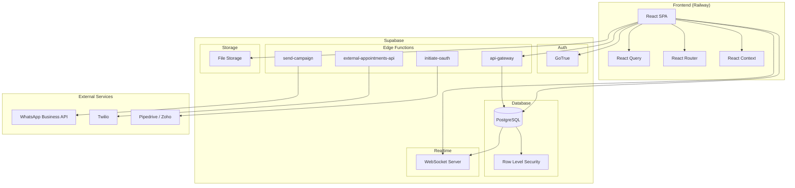
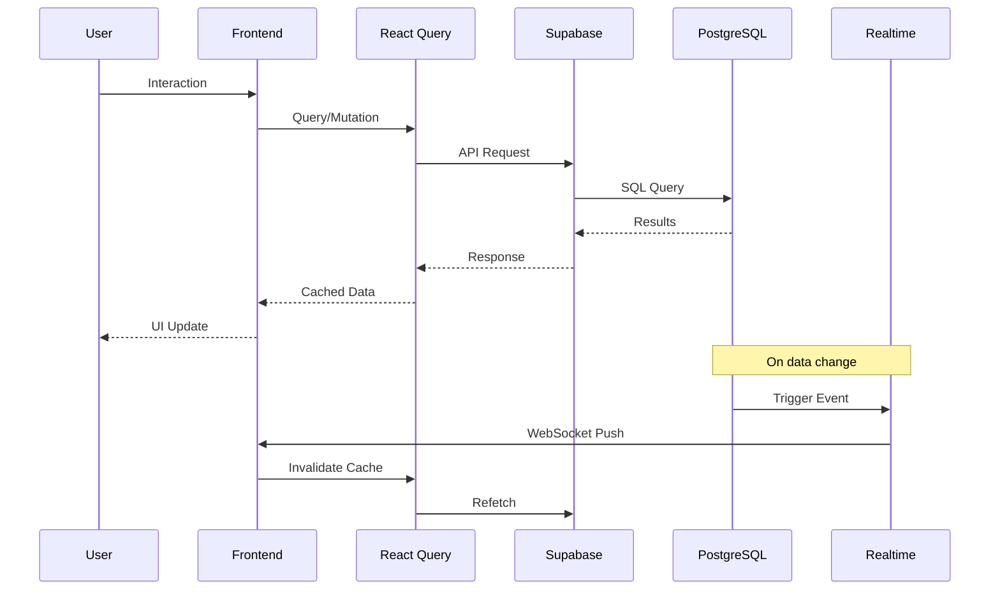
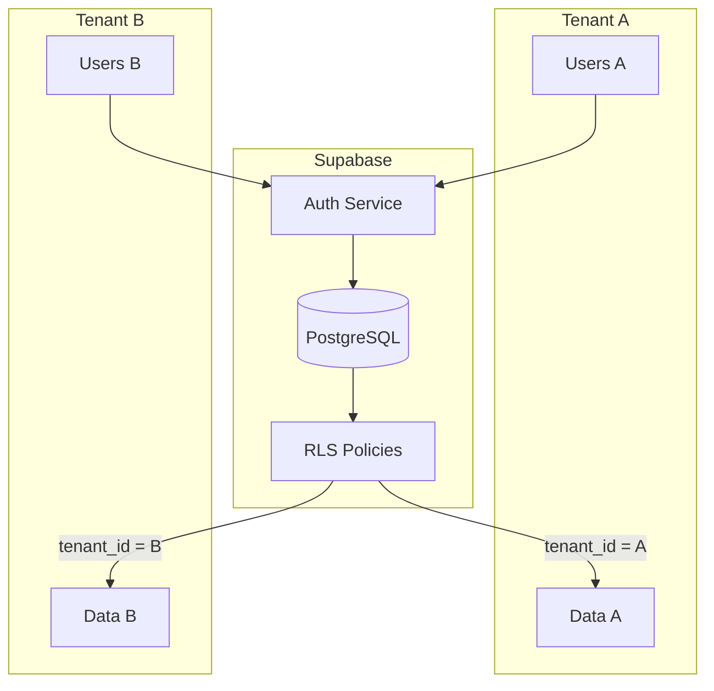
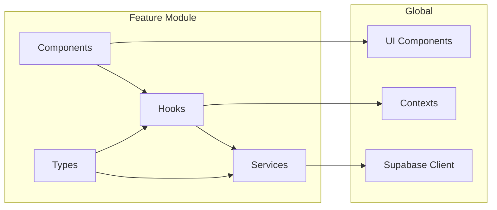
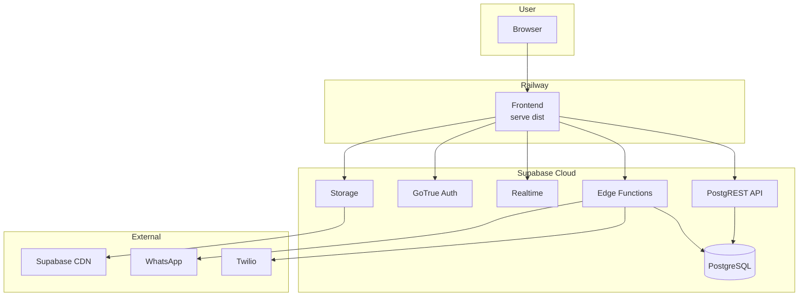
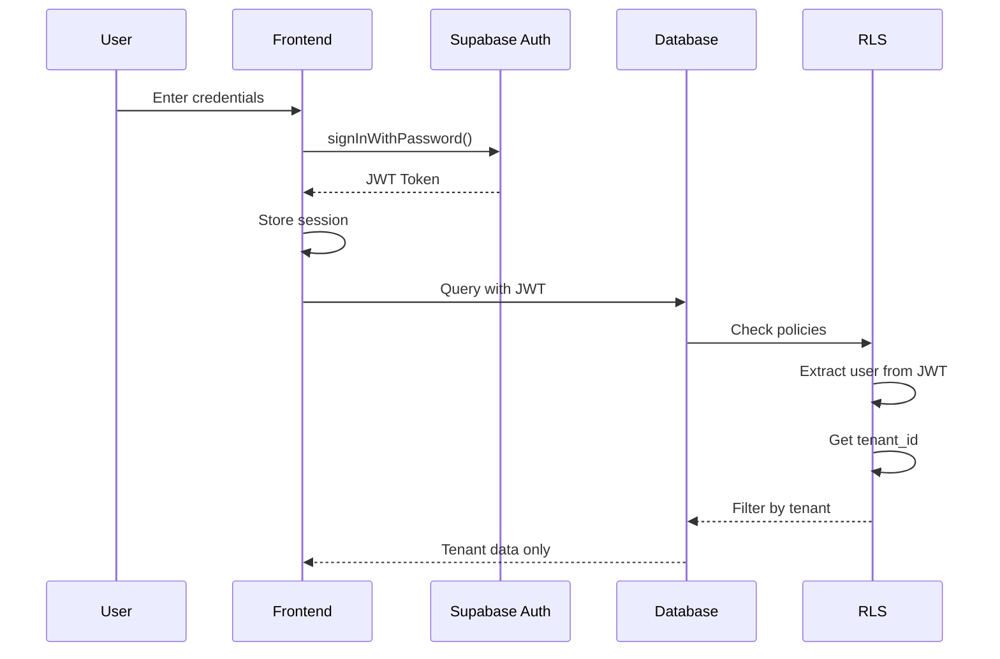
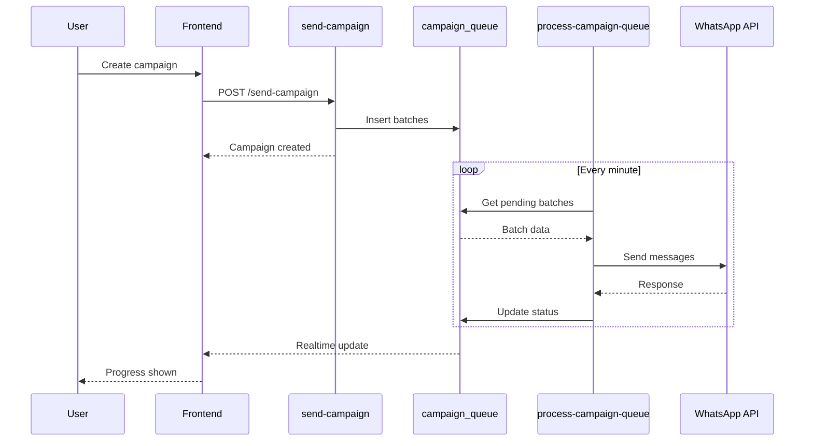

# System Overview Diagram

## Arquitectura General

## Flujo de Datos

## Multi-Tenant Architecture

## Feature Module Structure

## Deployment Architecture

## Authentication Flow

## Campaign Processing Flow

