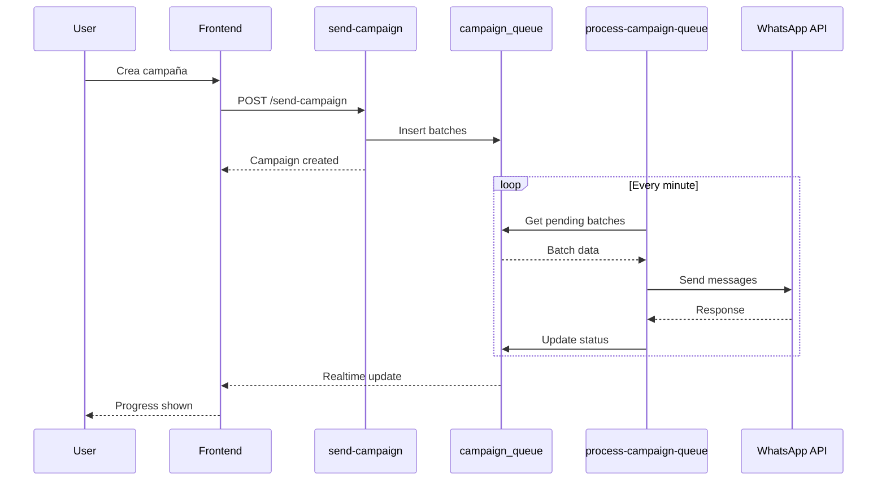

# Feature: Campaigns

Campañas de broadcast para WhatsApp y llamadas.

## Descripción

El módulo Campaigns permite crear y ejecutar campañas masivas de comunicación a través de WhatsApp o llamadas telefónicas. Los contactos se procesan en batches con rate limiting para respetar límites de las APIs.

## Casos de Uso

1. Crear campaña de WhatsApp con template
2. Crear campaña de llamadas automáticas
3. Seleccionar contactos manualmente o por CSV
4. Monitorear progreso en tiempo real
5. Ver métricas y resultados

## Estructura de Archivos

```
src/features/campaigns/
├── components/
│   ├── CampaignsList.tsx
│   ├── CampaignCard.tsx
│   ├── CampaignForm/
│   │   ├── CampaignForm.tsx
│   │   ├── ContactSelector.tsx
│   │   ├── CsvUploader.tsx
│   │   └── TemplateSelector.tsx
│   ├── CampaignProgress.tsx
│   └── CampaignStats.tsx
├── hooks/
│   ├── useCampaigns.ts
│   ├── useCampaign.ts
│   ├── useCampaignMutations.ts
│   └── useWhatsAppTemplates.ts
├── services/
│   ├── campaigns.service.ts
│   └── whatsapp-templates.service.ts
└── types/
    └── index.ts
```

## Base de Datos

### Tabla: campaigns

| Columna | Tipo | Descripción |
|---------|------|-------------|
| id | UUID | Primary key |
| tenant_id | UUID | FK a tenants |
| name | TEXT | Nombre de campaña |
| type | ENUM | 'whatsapp', 'call' |
| status | ENUM | Estado de la campaña |
| template_name | TEXT | Nombre del template (WhatsApp) |
| template_params | JSONB | Parámetros del template |
| total_contacts | INTEGER | Total de contactos |
| batches_total | INTEGER | Total de batches |
| batches_sent | INTEGER | Batches enviados |
| batches_failed | INTEGER | Batches fallidos |
| scheduled_at | TIMESTAMPTZ | Fecha programada |
| started_at | TIMESTAMPTZ | Inicio de ejecución |
| completed_at | TIMESTAMPTZ | Fin de ejecución |
| created_by | UUID | Usuario creador |
| created_at | TIMESTAMPTZ | Fecha de creación |

### Tabla: campaign_queue

| Columna | Tipo | Descripción |
|---------|------|-------------|
| id | UUID | Primary key |
| campaign_id | UUID | FK a campaigns |
| batch_number | INTEGER | Número de batch |
| phone_numbers | TEXT[] | Números del batch |
| status | ENUM | 'pending', 'processing', 'sent', 'failed' |
| error_message | TEXT | Error si falló |
| scheduled_for | TIMESTAMPTZ | Cuándo enviar |
| processed_at | TIMESTAMPTZ | Cuándo se procesó |

### Estados de Campaña

| Estado | Descripción |
|--------|-------------|
| `draft` | Borrador, no enviada |
| `pending` | Esperando inicio |
| `in_progress` | Ejecutándose |
| `completed` | Finalizada exitosamente |
| `failed` | Falló completamente |
| `cancelled` | Cancelada por usuario |

## Hooks

### useCampaigns

```typescript
// src/features/campaigns/hooks/useCampaigns.ts
export function useCampaigns(filters: CampaignFilters, page: number = 1) {
  const { tenantId } = useProfile();

  return useQuery({
    queryKey: ['campaigns', tenantId, filters, page],
    queryFn: () => campaignsService.getCampaigns(tenantId!, filters, page),
    enabled: !!tenantId,
  });
}
```

### useCampaignMutations

```typescript
export function useCampaignMutations() {
  const queryClient = useQueryClient();
  const { tenantId } = useProfile();

  const create = useMutation({
    mutationFn: async (data: CreateCampaignData) => {
      // 1. Crear campaña
      const campaign = await campaignsService.createCampaign({
        ...data,
        tenant_id: tenantId!,
      });

      // 2. Encolar batches via Edge Function
      await supabase.functions.invoke('send-campaign', {
        body: {
          campaign_id: campaign.id,
          contacts: data.contacts,
        },
      });

      return campaign;
    },
    onSuccess: () => {
      queryClient.invalidateQueries({ queryKey: ['campaigns', tenantId] });
      toast.success('Campaña creada y en cola');
    },
    onError: (error: Error) => {
      toast.error(error.message || 'Error al crear campaña');
    },
  });

  const cancel = useMutation({
    mutationFn: (campaignId: string) =>
      campaignsService.cancelCampaign(campaignId),
    onSuccess: () => {
      queryClient.invalidateQueries({ queryKey: ['campaigns'] });
      toast.success('Campaña cancelada');
    },
  });

  return { create, cancel };
}
```

### useWhatsAppTemplates

```typescript
export function useWhatsAppTemplates() {
  const { tenantId } = useProfile();

  return useQuery({
    queryKey: ['whatsapp-templates', tenantId],
    queryFn: async () => {
      const { data } = await supabase.functions.invoke('get-whatsapp-templates');
      return data.templates.filter((t: any) => t.status === 'APPROVED');
    },
    enabled: !!tenantId,
    staleTime: 5 * 60 * 1000, // 5 minutos
  });
}
```

## Componentes

### CampaignForm

```typescript
// src/features/campaigns/components/CampaignForm/CampaignForm.tsx
const campaignSchema = z.object({
  name: z.string().min(1, 'Nombre requerido'),
  type: z.enum(['whatsapp', 'call']),
  template_name: z.string().optional(),
  template_params: z.record(z.string()).optional(),
  contacts: z.array(z.string()).min(1, 'Selecciona al menos un contacto'),
  scheduled_at: z.string().optional(),
});

export function CampaignForm({ onSubmit }: Props) {
  const form = useForm<z.infer<typeof campaignSchema>>({
    resolver: zodResolver(campaignSchema),
  });

  const campaignType = form.watch('type');

  return (
    <Form {...form}>
      <form onSubmit={form.handleSubmit(onSubmit)} className="space-y-6">
        <FormField
          control={form.control}
          name="name"
          render={({ field }) => (
            <FormItem>
              <FormLabel>Nombre de la Campaña</FormLabel>
              <FormControl>
                <Input {...field} placeholder="Campaña de enero" />
              </FormControl>
              <FormMessage />
            </FormItem>
          )}
        />

        <FormField
          control={form.control}
          name="type"
          render={({ field }) => (
            <FormItem>
              <FormLabel>Tipo</FormLabel>
              <Select onValueChange={field.onChange} defaultValue={field.value}>
                <SelectTrigger>
                  <SelectValue placeholder="Selecciona tipo" />
                </SelectTrigger>
                <SelectContent>
                  <SelectItem value="whatsapp">WhatsApp</SelectItem>
                  <SelectItem value="call">Llamada</SelectItem>
                </SelectContent>
              </Select>
              <FormMessage />
            </FormItem>
          )}
        />

        {campaignType === 'whatsapp' && (
          <TemplateSelector control={form.control} />
        )}

        <ContactSelector control={form.control} />

        <Button type="submit">Crear Campaña</Button>
      </form>
    </Form>
  );
}
```

### ContactSelector

```typescript
// src/features/campaigns/components/CampaignForm/ContactSelector.tsx
export function ContactSelector({ control }: Props) {
  const [mode, setMode] = useState<'select' | 'csv'>('select');

  return (
    <div className="space-y-4">
      <Tabs value={mode} onValueChange={(v) => setMode(v as typeof mode)}>
        <TabsList>
          <TabsTrigger value="select">Seleccionar Contactos</TabsTrigger>
          <TabsTrigger value="csv">Subir CSV</TabsTrigger>
        </TabsList>

        <TabsContent value="select">
          <ContactsMultiSelect control={control} />
        </TabsContent>

        <TabsContent value="csv">
          <CsvUploader control={control} />
        </TabsContent>
      </Tabs>
    </div>
  );
}
```

### CampaignProgress

```typescript
// src/features/campaigns/components/CampaignProgress.tsx
export function CampaignProgress({ campaign }: { campaign: Campaign }) {
  const progress = campaign.batches_total > 0
    ? ((campaign.batches_sent + campaign.batches_failed) / campaign.batches_total) * 100
    : 0;

  const successRate = campaign.batches_sent + campaign.batches_failed > 0
    ? (campaign.batches_sent / (campaign.batches_sent + campaign.batches_failed)) * 100
    : 0;

  return (
    <div className="space-y-4">
      <div className="flex justify-between text-sm">
        <span>Progreso</span>
        <span>{Math.round(progress)}%</span>
      </div>
      <Progress value={progress} />

      <div className="grid grid-cols-3 gap-4 text-center">
        <div>
          <p className="text-2xl font-bold">{campaign.batches_sent}</p>
          <p className="text-sm text-muted-foreground">Enviados</p>
        </div>
        <div>
          <p className="text-2xl font-bold text-red-500">{campaign.batches_failed}</p>
          <p className="text-sm text-muted-foreground">Fallidos</p>
        </div>
        <div>
          <p className="text-2xl font-bold">
            {campaign.batches_total - campaign.batches_sent - campaign.batches_failed}
          </p>
          <p className="text-sm text-muted-foreground">Pendientes</p>
        </div>
      </div>

      <div className="text-sm">
        <span className="text-muted-foreground">Tasa de éxito: </span>
        <span className="font-medium">{successRate.toFixed(1)}%</span>
      </div>
    </div>
  );
}
```

## Edge Functions

### send-campaign

Crea batches en la cola para procesamiento.

```typescript
// supabase/functions/send-campaign/index.ts
serve(async (req) => {
  const { campaign_id, contacts } = await req.json();

  // Dividir en batches de 50
  const BATCH_SIZE = 50;
  const batches = chunk(contacts, BATCH_SIZE);

  // Insertar batches en cola
  const queueItems = batches.map((batch, index) => ({
    campaign_id,
    batch_number: index + 1,
    phone_numbers: batch,
    status: 'pending',
    scheduled_for: new Date(Date.now() + index * 60000), // 1 min entre batches
  }));

  await supabase.from('campaign_queue').insert(queueItems);

  // Actualizar totales de campaña
  await supabase.from('campaigns').update({
    status: 'pending',
    batches_total: batches.length,
  }).eq('id', campaign_id);

  return jsonResponse({ success: true, batches: batches.length });
});
```

### process-campaign-queue (Cron)

Procesa batches pendientes cada minuto.

```typescript
// supabase/functions/process-campaign-queue/index.ts
// Ejecutado por cron cada minuto

serve(async () => {
  // Obtener batches pendientes
  const { data: batches } = await supabase
    .from('campaign_queue')
    .select('*, campaign:campaigns(*)')
    .eq('status', 'pending')
    .lte('scheduled_for', new Date().toISOString())
    .limit(10);

  for (const batch of batches || []) {
    try {
      // Marcar como procesando
      await supabase.from('campaign_queue')
        .update({ status: 'processing' })
        .eq('id', batch.id);

      // Enviar mensajes
      if (batch.campaign.type === 'whatsapp') {
        await sendWhatsAppBatch(batch);
      } else {
        await sendCallBatch(batch);
      }

      // Marcar como enviado
      await supabase.from('campaign_queue')
        .update({ status: 'sent', processed_at: new Date().toISOString() })
        .eq('id', batch.id);

      // Incrementar contador de campaña
      await supabase.rpc('increment_campaign_batch', {
        p_campaign_id: batch.campaign_id,
        p_status: 'sent',
      });

    } catch (error) {
      // Marcar como fallido
      await supabase.from('campaign_queue').update({
        status: 'failed',
        error_message: error.message,
        processed_at: new Date().toISOString(),
      }).eq('id', batch.id);

      await supabase.rpc('increment_campaign_batch', {
        p_campaign_id: batch.campaign_id,
        p_status: 'failed',
      });
    }
  }
});
```

## Rutas

| Ruta | Componente | Descripción |
|------|------------|-------------|
| `/campaigns` | CampaignsPage | Lista de campañas |
| `/campaigns/new` | NewCampaignPage | Crear campaña |
| `/campaigns/:id` | CampaignDetailPage | Detalle y progreso |

## Realtime

```typescript
useRealtime({
  subscriptions: [
    {
      table: 'campaigns',
      filter: `tenant_id=eq.${tenantId}`,
      queryKeysToInvalidate: [['campaigns', tenantId]],
    },
    {
      table: 'campaign_queue',
      filter: `campaign_id=eq.${campaignId}`,
      queryKeysToInvalidate: [['campaign', campaignId]],
    },
  ],
  enabled: !!tenantId,
});
```

## Flujo Completo


