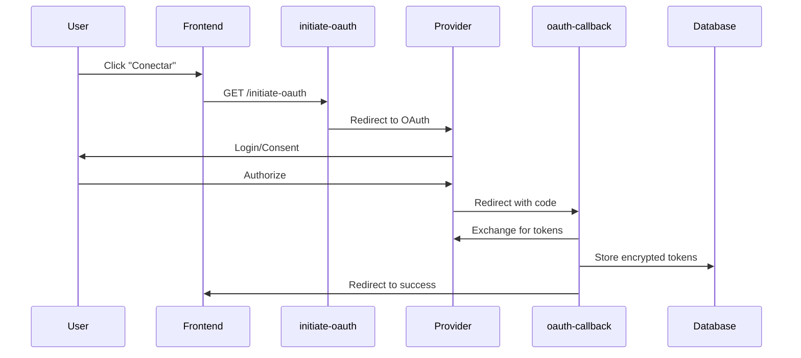

# Feature: Integrations

Gestión de integraciones con servicios externos.

## Descripción

El módulo Integrations permite conectar el dashboard con CRMs externos (Pipedrive, Zoho), servicios de mensajería (WhatsApp) y telefonía (Twilio). Usa OAuth 2.0 para autenticación segura y sincronización bidireccional de datos.

## Casos de Uso

1. Conectar CRM externo (Pipedrive/Zoho)
2. Sincronizar contactos desde CRM
3. Ver estado de integraciones
4. Configurar mapeo de campos personalizados
5. Desconectar integraciones

## Estructura de Archivos

```
src/features/integrations/
├── components/
│   ├── IntegrationsList.tsx
│   ├── IntegrationCard.tsx
│   ├── OAuthConnectButton.tsx
│   ├── SyncStatus.tsx
│   ├── FieldMappingDialog.tsx
│   └── providers/
│       ├── PipedriveCard.tsx
│       └── ZohoCard.tsx
├── hooks/
│   ├── useIntegrations.ts
│   ├── useIntegration.ts
│   ├── useIntegrationMutations.ts
│   └── useSyncLogs.ts
├── services/
│   └── integrations.service.ts
└── types/
    └── index.ts
```

## Base de Datos

### Tabla: integrations

| Columna | Tipo | Descripción |
|---------|------|-------------|
| id | UUID | Primary key |
| tenant_id | UUID | FK a tenants |
| provider | TEXT | 'pipedrive', 'zoho' |
| access_token | TEXT | Token encriptado |
| refresh_token | TEXT | Refresh token encriptado |
| expires_at | TIMESTAMPTZ | Expiración del token |
| metadata | JSONB | Configuración adicional |
| field_mapping | JSONB | Mapeo de campos |
| is_active | BOOLEAN | Si está activa |
| last_sync_at | TIMESTAMPTZ | Última sincronización |
| created_at | TIMESTAMPTZ | Fecha de conexión |
| updated_at | TIMESTAMPTZ | Última actualización |

### Tabla: integration_sync_logs

| Columna | Tipo | Descripción |
|---------|------|-------------|
| id | UUID | Primary key |
| integration_id | UUID | FK a integrations |
| sync_type | TEXT | 'full', 'incremental' |
| status | TEXT | Estado del sync |
| records_synced | INTEGER | Registros sincronizados |
| error_message | TEXT | Error si falló |
| started_at | TIMESTAMPTZ | Inicio |
| completed_at | TIMESTAMPTZ | Fin |

## Tipos

```typescript
// src/features/integrations/types/index.ts
export type Provider = 'pipedrive' | 'zoho';

export interface Integration {
  id: string;
  tenant_id: string;
  provider: Provider;
  is_active: boolean;
  metadata: Record<string, any>;
  field_mapping: Record<string, string>;
  last_sync_at: string | null;
  created_at: string;
}

export interface SyncLog {
  id: string;
  integration_id: string;
  sync_type: 'full' | 'incremental';
  status: 'pending' | 'in_progress' | 'completed' | 'failed';
  records_synced: number;
  error_message: string | null;
  started_at: string;
  completed_at: string | null;
}

export interface FieldMapping {
  sourceField: string;       // Campo en CRM externo
  targetField: string;       // Campo en nuestro sistema
  transform?: 'none' | 'lowercase' | 'uppercase' | 'phone_format';
}
```

## Hooks

### useIntegrations

```typescript
// src/features/integrations/hooks/useIntegrations.ts
export function useIntegrations() {
  const { tenantId } = useProfile();

  return useQuery({
    queryKey: ['integrations', tenantId],
    queryFn: () => integrationsService.getIntegrations(tenantId!),
    enabled: !!tenantId,
    staleTime: 60 * 1000,
  });
}
```

### useIntegration

```typescript
export function useIntegration(provider: Provider) {
  const { tenantId } = useProfile();

  return useQuery({
    queryKey: ['integration', tenantId, provider],
    queryFn: () => integrationsService.getIntegrationByProvider(tenantId!, provider),
    enabled: !!tenantId,
  });
}
```

### useIntegrationMutations

```typescript
export function useIntegrationMutations() {
  const queryClient = useQueryClient();
  const { tenantId } = useProfile();

  const disconnect = useMutation({
    mutationFn: (integrationId: string) =>
      integrationsService.disconnectIntegration(integrationId),
    onSuccess: () => {
      queryClient.invalidateQueries({ queryKey: ['integrations', tenantId] });
      toast.success('Integración desconectada');
    },
  });

  const sync = useMutation({
    mutationFn: ({ integrationId, syncType }: SyncParams) =>
      supabase.functions.invoke('sync-crm', {
        body: { integration_id: integrationId, sync_type: syncType },
      }),
    onSuccess: () => {
      queryClient.invalidateQueries({ queryKey: ['integrations'] });
      queryClient.invalidateQueries({ queryKey: ['contacts'] });
      toast.success('Sincronización iniciada');
    },
    onError: (error: Error) => {
      toast.error(error.message || 'Error al sincronizar');
    },
  });

  const updateFieldMapping = useMutation({
    mutationFn: ({ integrationId, mapping }: { integrationId: string; mapping: Record<string, string> }) =>
      integrationsService.updateFieldMapping(integrationId, mapping),
    onSuccess: () => {
      queryClient.invalidateQueries({ queryKey: ['integrations'] });
      toast.success('Mapeo actualizado');
    },
  });

  return { disconnect, sync, updateFieldMapping };
}
```

### useSyncLogs

```typescript
export function useSyncLogs(integrationId: string) {
  return useQuery({
    queryKey: ['sync-logs', integrationId],
    queryFn: () => integrationsService.getSyncLogs(integrationId),
    enabled: !!integrationId,
    refetchInterval: 10000, // Refetch cada 10s si hay sync en progreso
  });
}
```

## Componentes

### IntegrationsList

```typescript
// src/features/integrations/components/IntegrationsList.tsx
const PROVIDERS: { provider: Provider; name: string; icon: string; description: string }[] = [
  {
    provider: 'pipedrive',
    name: 'Pipedrive',
    icon: '/icons/pipedrive.svg',
    description: 'CRM de ventas para equipos pequeños',
  },
  {
    provider: 'zoho',
    name: 'Zoho CRM',
    icon: '/icons/zoho.svg',
    description: 'Suite completa de CRM',
  },
];

export function IntegrationsList() {
  const { data: integrations, isLoading } = useIntegrations();

  if (isLoading) return <LoadingSpinner />;

  return (
    <div className="grid gap-4 md:grid-cols-2">
      {PROVIDERS.map((providerConfig) => {
        const integration = integrations?.find(
          (i) => i.provider === providerConfig.provider
        );

        return (
          <IntegrationCard
            key={providerConfig.provider}
            config={providerConfig}
            integration={integration}
          />
        );
      })}
    </div>
  );
}
```

### IntegrationCard

```typescript
// src/features/integrations/components/IntegrationCard.tsx
export function IntegrationCard({ config, integration }: IntegrationCardProps) {
  const { disconnect, sync } = useIntegrationMutations();

  const isConnected = integration?.is_active;

  return (
    <Card>
      <CardHeader>
        <div className="flex items-center gap-3">
          
          <div>
            <CardTitle>{config.name}</CardTitle>
            <CardDescription>{config.description}</CardDescription>
          </div>
        </div>
      </CardHeader>

      <CardContent>
        {isConnected ? (
          <div className="space-y-4">
            <Badge variant="success">Conectado</Badge>

            {integration.last_sync_at && (
              <p className="text-sm text-muted-foreground">
                Última sync: {formatDistanceToNow(new Date(integration.last_sync_at))}
              </p>
            )}

            <div className="flex gap-2">
              <Button
                variant="outline"
                size="sm"
                onClick={() => sync.mutate({
                  integrationId: integration.id,
                  syncType: 'incremental',
                })}
                disabled={sync.isPending}
              >
                {sync.isPending ? 'Sincronizando...' : 'Sincronizar'}
              </Button>

              <FieldMappingDialog integration={integration} />

              <Button
                variant="ghost"
                size="sm"
                onClick={() => disconnect.mutate(integration.id)}
              >
                Desconectar
              </Button>
            </div>
          </div>
        ) : (
          <OAuthConnectButton provider={config.provider} />
        )}
      </CardContent>
    </Card>
  );
}
```

### OAuthConnectButton

```typescript
// src/features/integrations/components/OAuthConnectButton.tsx
export function OAuthConnectButton({ provider }: { provider: Provider }) {
  const { tenantId, userId } = useProfile();

  const handleConnect = () => {
    const params = new URLSearchParams({
      provider,
      tenant_id: tenantId!,
      user_id: userId!,
    });

    // Redirigir a Edge Function que inicia OAuth
    window.location.href = `${import.meta.env.VITE_SUPABASE_URL}/functions/v1/initiate-oauth?${params}`;
  };

  return (
    <Button onClick={handleConnect}>
      Conectar {provider}
    </Button>
  );
}
```

### SyncStatus

```typescript
// src/features/integrations/components/SyncStatus.tsx
export function SyncStatus({ integrationId }: { integrationId: string }) {
  const { data: logs, isLoading } = useSyncLogs(integrationId);

  const lastSync = logs?.[0];
  const isInProgress = lastSync?.status === 'in_progress';

  if (isLoading) return <Skeleton className="h-4 w-32" />;

  return (
    <div className="space-y-2">
      {isInProgress && (
        <div className="flex items-center gap-2 text-sm">
          <Loader2 className="h-4 w-4 animate-spin" />
          <span>Sincronizando...</span>
        </div>
      )}

      {lastSync && (
        <div className="text-sm">
          <span className={cn(
            lastSync.status === 'completed' && 'text-green-600',
            lastSync.status === 'failed' && 'text-red-600',
          )}>
            {lastSync.status === 'completed' && `✓ ${lastSync.records_synced} contactos sincronizados`}
            {lastSync.status === 'failed' && `✗ Error: ${lastSync.error_message}`}
          </span>
          <span className="text-muted-foreground ml-2">
            {formatDistanceToNow(new Date(lastSync.completed_at || lastSync.started_at))} ago
          </span>
        </div>
      )}
    </div>
  );
}
```

### FieldMappingDialog

```typescript
// src/features/integrations/components/FieldMappingDialog.tsx
export function FieldMappingDialog({ integration }: { integration: Integration }) {
  const [open, setOpen] = useState(false);
  const { updateFieldMapping } = useIntegrationMutations();
  const { data: customFields } = useCustomFields();

  const [mapping, setMapping] = useState(integration.field_mapping || {});

  // Campos disponibles del proveedor
  const providerFields = PROVIDER_FIELDS[integration.provider];

  return (
    <Dialog open={open} onOpenChange={setOpen}>
      <DialogTrigger asChild>
        <Button variant="outline" size="sm">
          Mapeo de campos
        </Button>
      </DialogTrigger>

      <DialogContent className="max-w-2xl">
        <DialogHeader>
          <DialogTitle>Mapeo de Campos</DialogTitle>
          <DialogDescription>
            Define cómo se mapean los campos del CRM externo a tus campos personalizados.
          </DialogDescription>
        </DialogHeader>

        <div className="space-y-4 max-h-96 overflow-y-auto">
          {providerFields.map((field) => (
            <div key={field.key} className="flex items-center gap-4">
              <span className="w-1/3 text-sm">{field.label}</span>
              <ArrowRight className="h-4 w-4 text-muted-foreground" />
              <Select
                value={mapping[field.key] || ''}
                onValueChange={(value) =>
                  setMapping({ ...mapping, [field.key]: value })
                }
              >
                <SelectTrigger className="w-1/3">
                  <SelectValue placeholder="No mapear" />
                </SelectTrigger>
                <SelectContent>
                  <SelectItem value="">No mapear</SelectItem>
                  <SelectItem value="nombre">Nombre</SelectItem>
                  <SelectItem value="numero">Teléfono</SelectItem>
                  <SelectItem value="email">Email</SelectItem>
                  {customFields?.map((cf) => (
                    <SelectItem key={cf.id} value={cf.field_key}>
                      {cf.label}
                    </SelectItem>
                  ))}
                </SelectContent>
              </Select>
            </div>
          ))}
        </div>

        <DialogFooter>
          <Button
            onClick={() => {
              updateFieldMapping.mutate({
                integrationId: integration.id,
                mapping,
              });
              setOpen(false);
            }}
            disabled={updateFieldMapping.isPending}
          >
            Guardar Mapeo
          </Button>
        </DialogFooter>
      </DialogContent>
    </Dialog>
  );
}
```

## Rutas

| Ruta | Componente | Descripción |
|------|------------|-------------|
| `/settings/integrations` | IntegrationsPage | Lista de integraciones |

## Edge Functions

| Function | Descripción |
|----------|-------------|
| `initiate-oauth` | Inicia flujo OAuth |
| `oauth-callback` | Procesa callback de OAuth |
| `sync-crm` | Sincroniza contactos desde CRM |
| `pipedrive-webhook` | Recibe webhooks de Pipedrive |

Ver [Integrations docs](../07-integrations/) para detalles de cada función.

## Flujo OAuth



## Seguridad

- Tokens encriptados con AES-256-GCM
- CSRF protection con state tokens
- Refresh automático de tokens expirados
- Scopes mínimos necesarios
