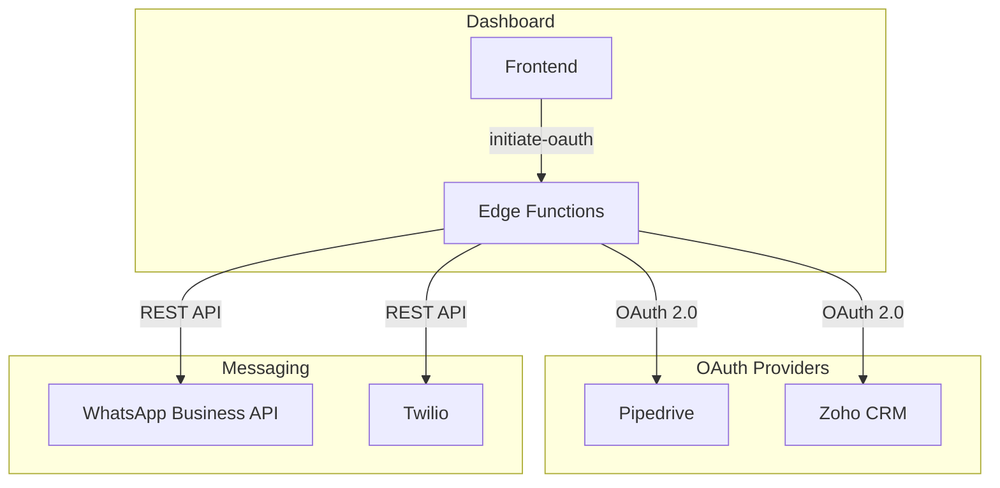

# Integrations

Integraciones con servicios externos.

## Contenido

1. [OAuth Flow](./oauth-flow.md) - Flujo completo de autenticación OAuth
2. [WhatsApp Business](./whatsapp-business.md) - API de WhatsApp Business
3. [Twilio](./twilio.md) - Llamadas telefónicas
4. [Pipedrive](./pipedrive.md) - CRM Pipedrive
5. [Adding Integration](./adding-integration.md) - Cómo agregar nueva integración

## Arquitectura de Integraciones



## Integraciones Disponibles

| Integración | Tipo | Propósito | Estado |
|-------------|------|-----------|--------|
| **Pipedrive** | CRM | Sincronización de contactos | Activo |
| **Zoho CRM** | CRM | Sincronización de contactos | Activo |
| **WhatsApp Business** | Mensajería | Envío/recepción de mensajes | Activo |
| **Twilio** | Telefonía | Llamadas entrantes/salientes | Activo |

## Modelo de Datos

### Tabla: integrations

```sql
CREATE TABLE integrations (
  id UUID PRIMARY KEY,
  tenant_id UUID NOT NULL,
  provider TEXT NOT NULL,           -- 'pipedrive', 'zoho', etc.
  access_token TEXT,                -- Encriptado
  refresh_token TEXT,               -- Encriptado
  expires_at TIMESTAMPTZ,
  metadata JSONB DEFAULT '{}',      -- Configuración adicional
  is_active BOOLEAN DEFAULT true,
  created_at TIMESTAMPTZ,
  updated_at TIMESTAMPTZ
);
```

### Tabla: integration_sync_logs

```sql
CREATE TABLE integration_sync_logs (
  id UUID PRIMARY KEY,
  integration_id UUID NOT NULL,
  sync_type TEXT,                   -- 'full', 'incremental'
  status TEXT,                      -- 'pending', 'in_progress', 'completed', 'failed'
  records_synced INTEGER DEFAULT 0,
  error_message TEXT,
  started_at TIMESTAMPTZ,
  completed_at TIMESTAMPTZ
);
```

## Seguridad

### Encriptación de Tokens

Todos los tokens OAuth se encriptan antes de almacenarse:

```typescript
// _shared/crypto.ts
import { createCipheriv, createDecipheriv, randomBytes } from 'node:crypto';

export function encryptToken(token: string, key: string): string {
  const iv = randomBytes(16);
  const cipher = createCipheriv('aes-256-gcm', Buffer.from(key, 'hex'), iv);
  // ...
}

export function decryptToken(encrypted: string, key: string): string {
  // ...
}
```

### Variables de Entorno

```env
# Encriptación
ENCRYPTION_KEY=your-32-byte-hex-key

# Pipedrive
PIPEDRIVE_CLIENT_ID=xxx
PIPEDRIVE_CLIENT_SECRET=xxx

# Zoho
ZOHO_CLIENT_ID=xxx
ZOHO_CLIENT_SECRET=xxx

# WhatsApp
WHATSAPP_ACCESS_TOKEN=xxx
WHATSAPP_PHONE_NUMBER_ID=xxx

# Twilio
TWILIO_ACCOUNT_SID=xxx
TWILIO_AUTH_TOKEN=xxx
```

## Feature: Integrations

```
src/features/integrations/
├── components/
│   ├── IntegrationCard.tsx
│   ├── IntegrationsList.tsx
│   └── OAuthConnectButton.tsx
├── hooks/
│   ├── useIntegrations.ts
│   └── useIntegrationMutations.ts
├── services/
│   └── integrations.service.ts
└── types/
    └── index.ts
```

## Quick Start

### Conectar Pipedrive

```typescript
// 1. Usuario hace clic en "Conectar Pipedrive"
const handleConnect = () => {
  window.location.href = `${SUPABASE_URL}/functions/v1/initiate-oauth?provider=pipedrive&tenant_id=${tenantId}`;
};

// 2. Usuario autoriza en Pipedrive
// 3. Pipedrive redirige a callback
// 4. Edge Function intercambia código por tokens
// 5. Tokens se encriptan y guardan
// 6. Usuario es redirigido al dashboard
```

### Sincronizar Contactos

```typescript
// Trigger manual sync
const { data } = await supabase.functions.invoke('sync-crm', {
  body: {
    integration_id: integrationId,
    sync_type: 'full', // o 'incremental'
  },
});
```
