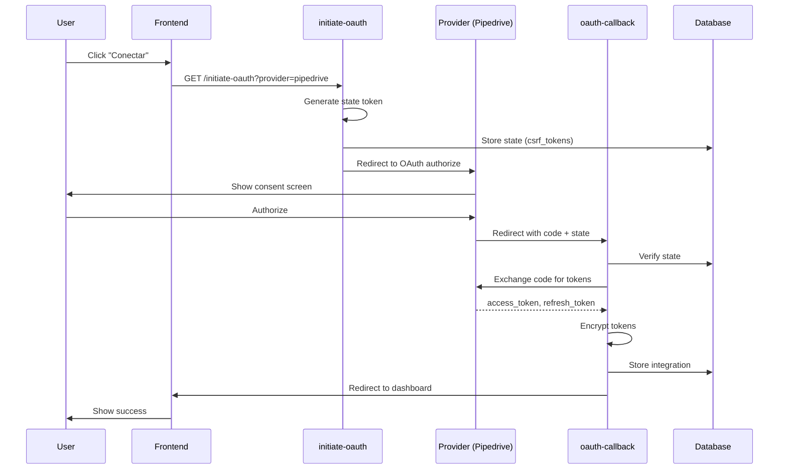

# OAuth Flow

Flujo completo de autenticación OAuth 2.0 para integraciones CRM.

## Diagrama de Flujo



## Edge Functions

### initiate-oauth

Inicia el flujo OAuth generando URL de autorización.

**Endpoint:** `GET /functions/v1/initiate-oauth`

**Query Parameters:**
| Parámetro | Tipo | Requerido | Descripción |
|-----------|------|-----------|-------------|
| `provider` | string | Sí | 'pipedrive' o 'zoho' |
| `tenant_id` | UUID | Sí | ID del tenant |
| `user_id` | UUID | Sí | ID del usuario |

**Flujo:**

```typescript
// supabase/functions/initiate-oauth/index.ts
import { serve } from 'https://deno.land/std@0.168.0/http/server.ts';
import { createClient } from '@supabase/supabase-js';

const PROVIDERS = {
  pipedrive: {
    authUrl: 'https://oauth.pipedrive.com/oauth/authorize',
    clientId: Deno.env.get('PIPEDRIVE_CLIENT_ID'),
    scopes: ['contacts:read', 'contacts:write'],
  },
  zoho: {
    authUrl: 'https://accounts.zoho.com/oauth/v2/auth',
    clientId: Deno.env.get('ZOHO_CLIENT_ID'),
    scopes: ['ZohoCRM.modules.contacts.READ'],
  },
};

serve(async (req) => {
  const url = new URL(req.url);
  const provider = url.searchParams.get('provider');
  const tenantId = url.searchParams.get('tenant_id');
  const userId = url.searchParams.get('user_id');

  // 1. Generate CSRF state token
  const state = crypto.randomUUID();

  // 2. Store state in database
  const supabase = createClient(/* ... */);
  await supabase.from('csrf_tokens').insert({
    token: state,
    tenant_id: tenantId,
    user_id: userId,
    provider,
    expires_at: new Date(Date.now() + 10 * 60 * 1000), // 10 min
  });

  // 3. Build authorization URL
  const config = PROVIDERS[provider];
  const authUrl = new URL(config.authUrl);
  authUrl.searchParams.set('client_id', config.clientId);
  authUrl.searchParams.set('redirect_uri', `${SUPABASE_URL}/functions/v1/oauth-callback`);
  authUrl.searchParams.set('response_type', 'code');
  authUrl.searchParams.set('scope', config.scopes.join(' '));
  authUrl.searchParams.set('state', state);

  // 4. Redirect to provider
  return new Response(null, {
    status: 302,
    headers: { Location: authUrl.toString() },
  });
});
```

### oauth-callback

Procesa el callback de OAuth e intercambia código por tokens.

**Endpoint:** `GET /functions/v1/oauth-callback`

**Query Parameters:**
| Parámetro | Tipo | Descripción |
|-----------|------|-------------|
| `code` | string | Authorization code |
| `state` | string | CSRF state token |
| `error` | string | Error (si falla) |

**Flujo:**

```typescript
// supabase/functions/oauth-callback/index.ts
serve(async (req) => {
  const url = new URL(req.url);
  const code = url.searchParams.get('code');
  const state = url.searchParams.get('state');
  const error = url.searchParams.get('error');

  // 1. Handle errors
  if (error) {
    return redirectToError(error);
  }

  // 2. Verify CSRF state
  const { data: csrfData } = await supabase
    .from('csrf_tokens')
    .select('*')
    .eq('token', state)
    .gt('expires_at', new Date().toISOString())
    .single();

  if (!csrfData) {
    return redirectToError('Invalid state token');
  }

  // 3. Exchange code for tokens
  const tokens = await exchangeCodeForTokens(code, csrfData.provider);

  // 4. Encrypt tokens
  const encryptedAccess = encryptToken(tokens.access_token);
  const encryptedRefresh = encryptToken(tokens.refresh_token);

  // 5. Store integration
  await supabase.from('integrations').upsert({
    tenant_id: csrfData.tenant_id,
    provider: csrfData.provider,
    access_token: encryptedAccess,
    refresh_token: encryptedRefresh,
    expires_at: new Date(Date.now() + tokens.expires_in * 1000),
    is_active: true,
  });

  // 6. Cleanup CSRF token
  await supabase.from('csrf_tokens').delete().eq('token', state);

  // 7. Redirect to success
  return new Response(null, {
    status: 302,
    headers: {
      Location: `${FRONTEND_URL}/settings/integrations?success=true`,
    },
  });
});
```

## Token Refresh

Los tokens se refrescan automáticamente antes de expirar:

```typescript
// _shared/oauth.ts
export async function getValidAccessToken(integration: Integration): Promise<string> {
  // Check if token is expired or about to expire (5 min buffer)
  const expiresAt = new Date(integration.expires_at);
  const buffer = 5 * 60 * 1000; // 5 minutes

  if (expiresAt.getTime() - buffer > Date.now()) {
    // Token still valid
    return decryptToken(integration.access_token);
  }

  // Refresh token
  const newTokens = await refreshAccessToken(
    integration.provider,
    decryptToken(integration.refresh_token)
  );

  // Update in database
  await supabase.from('integrations').update({
    access_token: encryptToken(newTokens.access_token),
    refresh_token: encryptToken(newTokens.refresh_token),
    expires_at: new Date(Date.now() + newTokens.expires_in * 1000),
  }).eq('id', integration.id);

  return newTokens.access_token;
}

async function refreshAccessToken(provider: string, refreshToken: string) {
  const config = PROVIDERS[provider];

  const response = await fetch(config.tokenUrl, {
    method: 'POST',
    headers: { 'Content-Type': 'application/x-www-form-urlencoded' },
    body: new URLSearchParams({
      grant_type: 'refresh_token',
      refresh_token: refreshToken,
      client_id: config.clientId,
      client_secret: config.clientSecret,
    }),
  });

  return response.json();
}
```

## Frontend Integration

```typescript
// src/features/integrations/components/OAuthConnectButton.tsx
import { Button } from '@/components/ui/button';
import { useProfile } from '@/hooks/use-profile';

interface Props {
  provider: 'pipedrive' | 'zoho';
}

export function OAuthConnectButton({ provider }: Props) {
  const { tenantId, userId } = useProfile();

  const handleConnect = () => {
    const params = new URLSearchParams({
      provider,
      tenant_id: tenantId!,
      user_id: userId!,
    });

    window.location.href = `${import.meta.env.VITE_SUPABASE_URL}/functions/v1/initiate-oauth?${params}`;
  };

  return (
    <Button onClick={handleConnect}>
      Conectar {provider}
    </Button>
  );
}
```

## Manejo de Errores

| Error | Causa | Solución |
|-------|-------|----------|
| `invalid_state` | Token CSRF inválido o expirado | Reiniciar flujo OAuth |
| `access_denied` | Usuario denegó acceso | Mostrar mensaje informativo |
| `invalid_grant` | Código ya usado o expirado | Reiniciar flujo OAuth |
| `invalid_client` | Credenciales incorrectas | Verificar client_id/secret |

```typescript
// Error handling in callback
function handleOAuthError(error: string): Response {
  const errorMessages = {
    access_denied: 'Acceso denegado por el usuario',
    invalid_state: 'Sesión expirada, intenta nuevamente',
    invalid_grant: 'Código de autorización inválido',
  };

  const message = errorMessages[error] || 'Error desconocido';

  return new Response(null, {
    status: 302,
    headers: {
      Location: `${FRONTEND_URL}/settings/integrations?error=${encodeURIComponent(message)}`,
    },
  });
}
```

## Seguridad

### CSRF Protection

- State token único por solicitud
- Expira en 10 minutos
- Se elimina después de uso

### Token Storage

- Tokens encriptados con AES-256-GCM
- Key de encriptación en variables de entorno
- Nunca expuestos al frontend

### Scope Minimization

- Solicitar solo scopes necesarios
- Documentar permisos requeridos por integración
