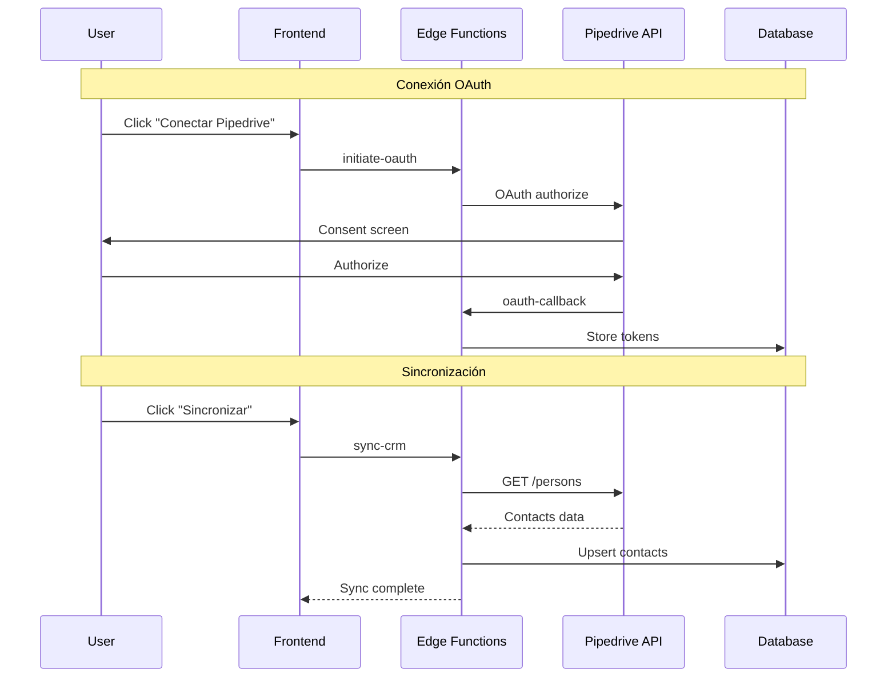

# Pipedrive Integration

Integración con Pipedrive CRM para sincronización de contactos.

## Arquitectura



## Configuración OAuth

### Variables de Entorno

```env
PIPEDRIVE_CLIENT_ID=your-client-id
PIPEDRIVE_CLIENT_SECRET=your-client-secret
PIPEDRIVE_REDIRECT_URI=https://<project>.supabase.co/functions/v1/oauth-callback
```

### Scopes Requeridos

| Scope | Descripción |
|-------|-------------|
| `contacts:read` | Leer personas/contactos |
| `contacts:write` | Crear/actualizar personas |
| `deals:read` | Leer deals (opcional) |
| `activities:read` | Leer actividades (opcional) |

### Registrar App en Pipedrive

1. Developer Hub → Create App
2. OAuth & Access Scopes:
   - Agregar scopes necesarios
   - Redirect URI: tu callback URL
3. Copiar Client ID y Secret

## Sincronización de Contactos

### sync-crm Edge Function

```typescript
// supabase/functions/sync-crm/index.ts
serve(async (req) => {
  const { integration_id, sync_type } = await req.json();

  // 1. Obtener integración con tokens
  const { data: integration } = await supabase
    .from('integrations')
    .select('*')
    .eq('id', integration_id)
    .single();

  // 2. Obtener access token válido (refresh si necesario)
  const accessToken = await getValidAccessToken(integration);

  // 3. Crear log de sincronización
  const { data: syncLog } = await supabase
    .from('integration_sync_logs')
    .insert({
      integration_id,
      sync_type,
      status: 'in_progress',
      started_at: new Date().toISOString(),
    })
    .select()
    .single();

  try {
    // 4. Obtener contactos de Pipedrive
    const contacts = await fetchAllPipedrivePersons(accessToken, sync_type);

    // 5. Mapear y upsert contactos
    let synced = 0;
    for (const person of contacts) {
      await upsertContact(integration.tenant_id, person);
      synced++;
    }

    // 6. Marcar sync como completado
    await supabase
      .from('integration_sync_logs')
      .update({
        status: 'completed',
        records_synced: synced,
        completed_at: new Date().toISOString(),
      })
      .eq('id', syncLog.id);

    return jsonResponse({ success: true, synced });

  } catch (error) {
    // Marcar sync como fallido
    await supabase
      .from('integration_sync_logs')
      .update({
        status: 'failed',
        error_message: error.message,
        completed_at: new Date().toISOString(),
      })
      .eq('id', syncLog.id);

    return jsonResponse({ success: false, error: error.message }, 500);
  }
});
```

### Fetch Persons con Paginación

```typescript
async function fetchAllPipedrivePersons(
  accessToken: string,
  syncType: 'full' | 'incremental'
): Promise<PipedrivePerson[]> {
  const baseUrl = 'https://api.pipedrive.com/v1/persons';
  const allPersons: PipedrivePerson[] = [];
  let start = 0;
  const limit = 100;

  // Para incremental, solo últimas 24 horas
  const params: any = { limit };
  if (syncType === 'incremental') {
    const since = new Date(Date.now() - 24 * 60 * 60 * 1000);
    params.filter_id = await getOrCreateRecentFilter(accessToken, since);
  }

  while (true) {
    const url = new URL(baseUrl);
    url.searchParams.set('start', start.toString());
    url.searchParams.set('limit', limit.toString());

    const response = await fetch(url.toString(), {
      headers: { Authorization: `Bearer ${accessToken}` },
    });

    const data = await response.json();

    if (!data.success) {
      throw new Error(data.error || 'Failed to fetch persons');
    }

    allPersons.push(...(data.data || []));

    // Check for more pages
    if (!data.additional_data?.pagination?.more_items_in_collection) {
      break;
    }

    start += limit;
  }

  return allPersons;
}
```

### Mapeo de Campos

```typescript
interface PipedrivePerson {
  id: number;
  name: string;
  email: Array<{ value: string; primary: boolean }>;
  phone: Array<{ value: string; primary: boolean }>;
  org_id?: { name: string };
  owner_id?: { name: string };
  add_time: string;
  update_time: string;
  // Custom fields como propiedades dinámicas
  [key: string]: any;
}

function mapPipedriveToContact(
  person: PipedrivePerson,
  tenantId: string,
  fieldMapping: Record<string, string>
): ContactInsert {
  const primaryEmail = person.email?.find(e => e.primary)?.value;
  const primaryPhone = person.phone?.find(p => p.primary)?.value;

  // Mapear campos personalizados
  const attributes: Record<string, any> = {};
  for (const [pipedriveField, contactField] of Object.entries(fieldMapping)) {
    if (person[pipedriveField] !== undefined) {
      attributes[contactField] = person[pipedriveField];
    }
  }

  return {
    tenant_id: tenantId,
    numero: normalizePhone(primaryPhone),
    nombre: person.name,
    email: primaryEmail,
    external_id: `pipedrive_${person.id}`,
    external_source: 'pipedrive',
    attributes,
  };
}
```

### Upsert Contact

```typescript
async function upsertContact(tenantId: string, person: PipedrivePerson) {
  const contact = mapPipedriveToContact(person, tenantId, {});

  // Upsert por external_id
  const { error } = await supabase
    .from('crm_contacts')
    .upsert(contact, {
      onConflict: 'tenant_id,external_id',
      ignoreDuplicates: false,
    });

  if (error) throw error;
}
```

## Webhook de Pipedrive

Recibir updates en tiempo real de Pipedrive.

### Configurar Webhook en Pipedrive

```typescript
// Crear webhook via API
const response = await fetch('https://api.pipedrive.com/v1/webhooks', {
  method: 'POST',
  headers: {
    Authorization: `Bearer ${accessToken}`,
    'Content-Type': 'application/json',
  },
  body: JSON.stringify({
    subscription_url: `${SUPABASE_URL}/functions/v1/pipedrive-webhook`,
    event_action: '*',
    event_object: 'person',
  }),
});
```

### Procesar Webhook

```typescript
// supabase/functions/pipedrive-webhook/index.ts
serve(async (req) => {
  const payload = await req.json();

  const { event, current, previous } = payload;
  // event: "added.person", "updated.person", "deleted.person"

  // Buscar integración por metadata
  const { data: integration } = await supabase
    .from('integrations')
    .select('tenant_id')
    .eq('provider', 'pipedrive')
    .eq('metadata->company_id', payload.meta.company_id)
    .single();

  if (!integration) {
    return new Response('Unknown company', { status: 404 });
  }

  switch (event) {
    case 'added.person':
    case 'updated.person':
      await upsertContact(integration.tenant_id, current);
      break;

    case 'deleted.person':
      await supabase
        .from('crm_contacts')
        .update({ deleted_at: new Date().toISOString() })
        .eq('external_id', `pipedrive_${previous.id}`)
        .eq('tenant_id', integration.tenant_id);
      break;
  }

  return new Response('OK');
});
```

## UI de Sincronización

```typescript
// src/features/integrations/components/PipedriveSync.tsx
import { useState } from 'react';
import { Button } from '@/components/ui/button';
import { Progress } from '@/components/ui/progress';
import { RefreshCw } from 'lucide-react';

interface Props {
  integrationId: string;
}

export function PipedriveSync({ integrationId }: Props) {
  const [syncing, setSyncing] = useState(false);
  const [progress, setProgress] = useState(0);

  const handleSync = async (syncType: 'full' | 'incremental') => {
    setSyncing(true);
    setProgress(0);

    try {
      const { data, error } = await supabase.functions.invoke('sync-crm', {
        body: { integration_id: integrationId, sync_type: syncType },
      });

      if (error) throw error;

      toast.success(`Sincronizados ${data.synced} contactos`);
    } catch (error) {
      toast.error('Error al sincronizar');
    } finally {
      setSyncing(false);
    }
  };

  return (
    <div className="space-y-4">
      <div className="flex gap-2">
        <Button
          onClick={() => handleSync('incremental')}
          disabled={syncing}
        >
          <RefreshCw className={syncing ? 'animate-spin' : ''} />
          Sync Incremental
        </Button>

        <Button
          variant="outline"
          onClick={() => handleSync('full')}
          disabled={syncing}
        >
          Sync Completo
        </Button>
      </div>

      {syncing && (
        <div className="space-y-2">
          <Progress value={progress} />
          <p className="text-sm text-muted-foreground">
            Sincronizando contactos...
          </p>
        </div>
      )}
    </div>
  );
}
```

## Mapeo de Campos Personalizado

```typescript
// src/features/integrations/components/FieldMapping.tsx
interface Props {
  pipedriveFields: PipedriveField[];
  contactFields: CustomField[];
  mapping: Record<string, string>;
  onMappingChange: (mapping: Record<string, string>) => void;
}

export function FieldMapping({
  pipedriveFields,
  contactFields,
  mapping,
  onMappingChange,
}: Props) {
  return (
    <div className="space-y-4">
      <h3 className="font-medium">Mapeo de Campos</h3>

      {pipedriveFields.map((pdField) => (
        <div key={pdField.key} className="flex items-center gap-4">
          <span className="w-1/3">{pdField.name}</span>
          <span>→</span>
          <Select
            value={mapping[pdField.key] || ''}
            onValueChange={(value) =>
              onMappingChange({ ...mapping, [pdField.key]: value })
            }
          >
            <SelectTrigger className="w-1/3">
              <SelectValue placeholder="Seleccionar campo" />
            </SelectTrigger>
            <SelectContent>
              <SelectItem value="">No mapear</SelectItem>
              {contactFields.map((cf) => (
                <SelectItem key={cf.id} value={cf.field_key}>
                  {cf.label}
                </SelectItem>
              ))}
            </SelectContent>
          </Select>
        </div>
      ))}
    </div>
  );
}
```

## Errores Comunes

| Error | Causa | Solución |
|-------|-------|----------|
| 401 Unauthorized | Token expirado | Refresh token |
| 403 Forbidden | Scope insuficiente | Reconectar con más permisos |
| 429 Rate Limit | Demasiadas requests | Implementar backoff |
| 400 Bad Request | Datos inválidos | Validar antes de enviar |

## Rate Limits

- **Standard:** 100 requests/10 segundos
- **Bulk operations:** Use batch endpoints cuando sea posible
- **Backoff:** Esperar y reintentar en 429

```typescript
async function fetchWithRetry(url: string, options: RequestInit, maxRetries = 3) {
  for (let i = 0; i < maxRetries; i++) {
    const response = await fetch(url, options);

    if (response.status === 429) {
      const retryAfter = parseInt(response.headers.get('Retry-After') || '10');
      await sleep(retryAfter * 1000);
      continue;
    }

    return response;
  }

  throw new Error('Max retries exceeded');
}
```
