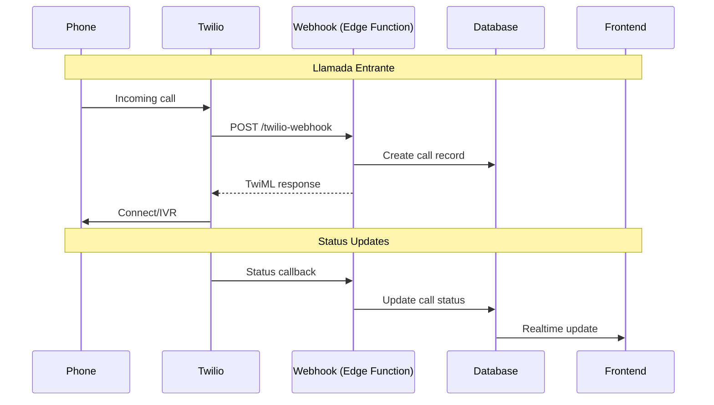

# Twilio Integration

Integración con Twilio para llamadas telefónicas.

## Arquitectura



## Configuración

### Variables de Entorno

```env
# Twilio
TWILIO_ACCOUNT_SID=ACxxxxxxxxxxxxxxxxx
TWILIO_AUTH_TOKEN=your-auth-token
TWILIO_PHONE_NUMBER=+1234567890
TWILIO_TWIML_APP_SID=APxxxxxxxxxxxxxxxxx
```

### Webhook Configuration

En Twilio Console:
1. Phone Numbers → Your number → Voice & Fax
2. Configure webhooks:
   - **A Call Comes In:** `https://<project>.supabase.co/functions/v1/twilio-webhook`
   - **Status Callback URL:** `https://<project>.supabase.co/functions/v1/twilio-status`

## Edge Functions

### twilio-webhook

Maneja llamadas entrantes y genera TwiML.

**Endpoint:** `POST /functions/v1/twilio-webhook`

**Twilio Request Fields:**
| Campo | Descripción |
|-------|-------------|
| `CallSid` | ID único de la llamada |
| `From` | Número que llama |
| `To` | Número destino |
| `CallStatus` | Estado actual |
| `Direction` | 'inbound' o 'outbound-api' |

**Implementación:**

```typescript
// supabase/functions/twilio-webhook/index.ts
import { serve } from 'https://deno.land/std@0.168.0/http/server.ts';
import { Twilio } from 'npm:twilio';

serve(async (req) => {
  // 1. Verificar firma de Twilio
  const signature = req.headers.get('x-twilio-signature');
  if (!verifyTwilioSignature(signature, req.url, await req.text())) {
    return new Response('Unauthorized', { status: 401 });
  }

  const formData = await req.formData();
  const callSid = formData.get('CallSid');
  const from = formData.get('From');
  const to = formData.get('To');

  // 2. Buscar tenant por número
  const { data: tenant } = await supabase
    .from('tenant_phone_numbers')
    .select('tenant_id')
    .eq('phone_number', to)
    .single();

  // 3. Buscar o crear contacto
  const { data: contact } = await supabase
    .from('crm_contacts')
    .select('id, nombre')
    .eq('numero', normalizePhone(from))
    .eq('tenant_id', tenant.tenant_id)
    .single();

  // 4. Crear registro de llamada
  await supabase.from('crm_calls').insert({
    tenant_id: tenant.tenant_id,
    contact_id: contact?.id,
    call_sid: callSid,
    from_number: from,
    to_number: to,
    direction: 'inbound',
    state: 'pending',
    started_at: new Date().toISOString(),
  });

  // 5. Generar TwiML response
  const twiml = new Twilio.twiml.VoiceResponse();

  if (contact) {
    twiml.say({ language: 'es-MX' }, `Bienvenido ${contact.nombre}`);
  } else {
    twiml.say({ language: 'es-MX' }, 'Gracias por llamar');
  }

  // IVR menu
  const gather = twiml.gather({
    numDigits: 1,
    action: '/twilio-menu',
    method: 'POST',
  });
  gather.say('Presione 1 para ventas, 2 para soporte');

  return new Response(twiml.toString(), {
    headers: { 'Content-Type': 'text/xml' },
  });
});
```

### twilio-status

Actualiza estados de llamada.

**Status Values:**
| Status | Descripción |
|--------|-------------|
| `queued` | En cola |
| `ringing` | Timbrando |
| `in-progress` | En progreso |
| `completed` | Completada |
| `busy` | Ocupado |
| `failed` | Falló |
| `no-answer` | Sin respuesta |
| `canceled` | Cancelada |

```typescript
// supabase/functions/twilio-status/index.ts
serve(async (req) => {
  const formData = await req.formData();
  const callSid = formData.get('CallSid');
  const callStatus = formData.get('CallStatus');
  const callDuration = formData.get('CallDuration');
  const recordingUrl = formData.get('RecordingUrl');

  // Mapear status de Twilio a nuestros estados
  const stateMap = {
    'completed': 'completed',
    'busy': 'missed',
    'failed': 'failed',
    'no-answer': 'missed',
    'canceled': 'failed',
  };

  const updates: any = {
    state: stateMap[callStatus] || 'pending',
  };

  if (callStatus === 'completed') {
    updates.ended_at = new Date().toISOString();
    updates.duration_seconds = parseInt(callDuration);
  }

  if (recordingUrl) {
    updates.recording_url = recordingUrl;
  }

  await supabase
    .from('crm_calls')
    .update(updates)
    .eq('call_sid', callSid);

  return new Response('OK');
});
```

### initiate-call

Inicia llamadas salientes.

**Endpoint:** `POST /functions/v1/initiate-call`

**Body:**
```typescript
interface InitiateCallRequest {
  to: string;           // Número destino
  tenant_id: string;
  contact_id?: string;
  agent_id?: string;
  script_url?: string;  // URL de TwiML personalizado
}
```

```typescript
// supabase/functions/initiate-call/index.ts
import Twilio from 'npm:twilio';

serve(async (req) => {
  const { to, tenant_id, contact_id, agent_id, script_url } = await req.json();

  const client = new Twilio(ACCOUNT_SID, AUTH_TOKEN);

  // 1. Obtener número del tenant
  const { data: tenantPhone } = await supabase
    .from('tenant_phone_numbers')
    .select('phone_number')
    .eq('tenant_id', tenant_id)
    .single();

  // 2. Iniciar llamada
  const call = await client.calls.create({
    to: to,
    from: tenantPhone.phone_number,
    url: script_url || `${SUPABASE_URL}/functions/v1/twilio-outbound-script`,
    statusCallback: `${SUPABASE_URL}/functions/v1/twilio-status`,
    statusCallbackEvent: ['initiated', 'ringing', 'answered', 'completed'],
  });

  // 3. Registrar llamada
  await supabase.from('crm_calls').insert({
    tenant_id,
    contact_id,
    agent_id,
    call_sid: call.sid,
    from_number: tenantPhone.phone_number,
    to_number: to,
    direction: 'outbound',
    state: 'pending',
    started_at: new Date().toISOString(),
  });

  return jsonResponse({ success: true, call_sid: call.sid });
});
```

## Grabación de Llamadas

### Habilitar Grabación

```typescript
// En TwiML
const twiml = new VoiceResponse();
twiml.record({
  transcribe: true,
  transcribeCallback: `${SUPABASE_URL}/functions/v1/twilio-transcription`,
  maxLength: 3600,
  recordingStatusCallback: `${SUPABASE_URL}/functions/v1/twilio-recording`,
});
```

### Procesar Grabación

```typescript
// twilio-recording webhook
serve(async (req) => {
  const formData = await req.formData();
  const callSid = formData.get('CallSid');
  const recordingUrl = formData.get('RecordingUrl');
  const recordingDuration = formData.get('RecordingDuration');

  // Descargar y almacenar en Supabase Storage
  const audioResponse = await fetch(`${recordingUrl}.mp3`);
  const audioBuffer = await audioResponse.arrayBuffer();

  const { data: upload } = await supabase.storage
    .from('call-recordings')
    .upload(`${callSid}.mp3`, audioBuffer, {
      contentType: 'audio/mpeg',
    });

  // Actualizar registro
  await supabase
    .from('crm_calls')
    .update({
      recording_url: upload.path,
      recording_duration: parseInt(recordingDuration),
    })
    .eq('call_sid', callSid);
});
```

## Verificación de Firma

Siempre verificar que los webhooks vienen de Twilio:

```typescript
import { validateRequest } from 'npm:twilio/lib/webhooks/webhooks';

function verifyTwilioSignature(
  signature: string,
  url: string,
  params: Record<string, string>
): boolean {
  return validateRequest(
    TWILIO_AUTH_TOKEN,
    signature,
    url,
    params
  );
}
```

## Base de Datos

### Tabla: crm_calls

```sql
CREATE TABLE crm_calls (
  id UUID PRIMARY KEY DEFAULT gen_random_uuid(),
  tenant_id UUID NOT NULL REFERENCES tenants(id),
  contact_id UUID REFERENCES crm_contacts(id),
  agent_id UUID REFERENCES profiles(id),
  call_sid TEXT UNIQUE,
  from_number TEXT,
  to_number TEXT,
  direction call_direction NOT NULL,  -- 'inbound', 'outbound'
  state call_state DEFAULT 'pending',
  started_at TIMESTAMPTZ,
  ended_at TIMESTAMPTZ,
  duration_seconds INTEGER,
  recording_url TEXT,
  transcript TEXT,
  notes TEXT,
  metadata JSONB DEFAULT '{}',
  created_at TIMESTAMPTZ DEFAULT NOW()
);

CREATE TYPE call_state AS ENUM (
  'pending',
  'completed',
  'failed',
  'missed',
  'voicemail',
  'user_hangup',
  'scheduled'
);
```

## Frontend: Reproductor de Audio

```typescript
// src/features/calls/components/CallRecordingPlayer.tsx
import { useState, useRef } from 'react';
import { Play, Pause, Download } from 'lucide-react';

interface Props {
  recordingUrl: string;
  duration: number;
}

export function CallRecordingPlayer({ recordingUrl, duration }: Props) {
  const [isPlaying, setIsPlaying] = useState(false);
  const [currentTime, setCurrentTime] = useState(0);
  const audioRef = useRef<HTMLAudioElement>(null);

  const togglePlay = () => {
    if (audioRef.current) {
      if (isPlaying) {
        audioRef.current.pause();
      } else {
        audioRef.current.play();
      }
      setIsPlaying(!isPlaying);
    }
  };

  return (
    <div className="flex items-center gap-2 p-2 bg-muted rounded">
      <audio
        ref={audioRef}
        src={recordingUrl}
        onTimeUpdate={(e) => setCurrentTime(e.currentTarget.currentTime)}
        onEnded={() => setIsPlaying(false)}
      />

      <Button size="icon" variant="ghost" onClick={togglePlay}>
        {isPlaying ? <Pause /> : <Play />}
      </Button>

      <div className="flex-1">
        <Progress value={(currentTime / duration) * 100} />
      </div>

      <span className="text-sm text-muted-foreground">
        {formatDuration(currentTime)} / {formatDuration(duration)}
      </span>

      <Button size="icon" variant="ghost" asChild>
        <a href={recordingUrl} download>
          <Download />
        </a>
      </Button>
    </div>
  );
}
```

## Errores Comunes

| Error | Causa | Solución |
|-------|-------|----------|
| 21201 | Número inválido | Validar formato E.164 |
| 21214 | Número no verificado | Verificar en Twilio Console |
| 21608 | Número no soportado | Verificar país habilitado |
| 32001 | Auth error | Verificar credenciales |
