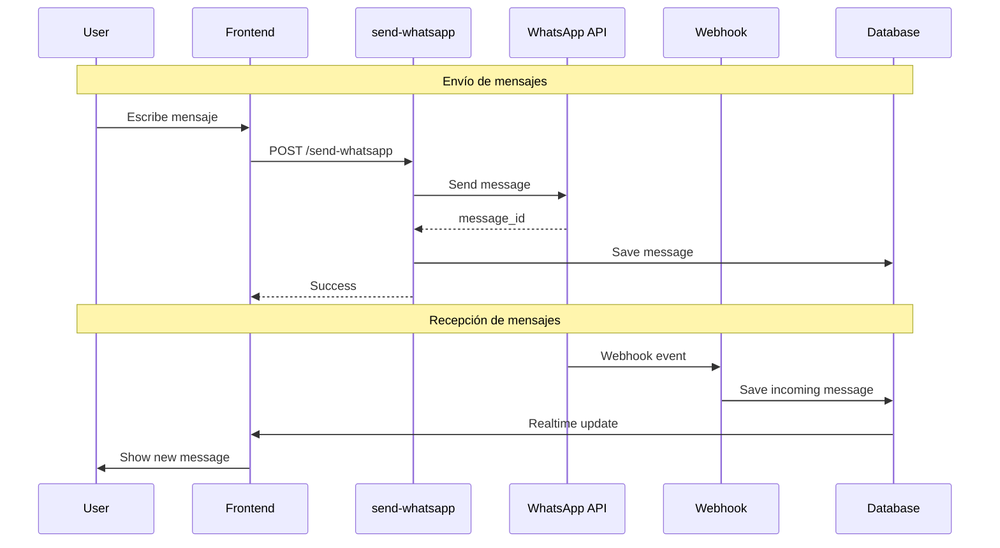

# WhatsApp Business API

Integración con WhatsApp Business API para envío y recepción de mensajes.

## Arquitectura



## Configuración

### Variables de Entorno

```env
# WhatsApp Business API
WHATSAPP_ACCESS_TOKEN=your-permanent-access-token
WHATSAPP_PHONE_NUMBER_ID=123456789012345
WHATSAPP_BUSINESS_ACCOUNT_ID=123456789012345
WHATSAPP_WEBHOOK_VERIFY_TOKEN=your-verify-token
```

### Webhook Setup

1. En Meta Developer Console:
   - App → WhatsApp → Configuration
   - Callback URL: `https://<project>.supabase.co/functions/v1/whatsapp-webhook`
   - Verify Token: Tu `WHATSAPP_WEBHOOK_VERIFY_TOKEN`
   - Suscribir a: `messages`, `message_status`

## Edge Functions

### send-whatsapp

Envía mensajes de WhatsApp.

**Endpoint:** `POST /functions/v1/send-whatsapp`

**Body:**
```typescript
interface SendWhatsAppRequest {
  phone_number: string;      // Número destino con código país
  message_type: 'text' | 'template' | 'image' | 'document' | 'audio';
  content: string;           // Texto o template name
  template_params?: string[]; // Parámetros para templates
  media_url?: string;        // URL del archivo
  conversation_id?: string;  // ID de conversación existente
  tenant_id: string;
}
```

**Response:**
```typescript
interface SendWhatsAppResponse {
  success: boolean;
  message_id?: string;       // ID de WhatsApp
  error?: string;
}
```

**Implementación:**

```typescript
// supabase/functions/send-whatsapp/index.ts
serve(async (req) => {
  const { phone_number, message_type, content, template_params, media_url, conversation_id, tenant_id } = await req.json();

  // 1. Verificar ventana de 24 horas
  if (message_type !== 'template') {
    const isInWindow = await checkMessageWindow(phone_number, tenant_id);
    if (!isInWindow) {
      return jsonResponse({
        success: false,
        error: 'Outside 24-hour window. Use template message.',
      }, 400);
    }
  }

  // 2. Construir payload según tipo
  const payload = buildMessagePayload(message_type, phone_number, content, template_params, media_url);

  // 3. Enviar a WhatsApp API
  const response = await fetch(
    `https://graph.facebook.com/v18.0/${PHONE_NUMBER_ID}/messages`,
    {
      method: 'POST',
      headers: {
        'Authorization': `Bearer ${WHATSAPP_ACCESS_TOKEN}`,
        'Content-Type': 'application/json',
      },
      body: JSON.stringify(payload),
    }
  );

  const result = await response.json();

  if (!response.ok) {
    return jsonResponse({
      success: false,
      error: result.error?.message || 'Failed to send message',
    }, 400);
  }

  // 4. Guardar mensaje en DB
  const messageId = result.messages[0].id;
  await saveOutgoingMessage({
    whatsapp_message_id: messageId,
    conversation_id,
    content,
    message_type,
    status: 'sent',
    tenant_id,
  });

  return jsonResponse({ success: true, message_id: messageId });
});
```

### whatsapp-webhook

Recibe eventos de WhatsApp (mensajes entrantes, estados).

**Endpoint:** `GET/POST /functions/v1/whatsapp-webhook`

**GET** - Verificación del webhook:

```typescript
// Verificación de webhook
if (req.method === 'GET') {
  const url = new URL(req.url);
  const mode = url.searchParams.get('hub.mode');
  const token = url.searchParams.get('hub.verify_token');
  const challenge = url.searchParams.get('hub.challenge');

  if (mode === 'subscribe' && token === WEBHOOK_VERIFY_TOKEN) {
    return new Response(challenge, { status: 200 });
  }
  return new Response('Forbidden', { status: 403 });
}
```

**POST** - Eventos entrantes:

```typescript
// Procesar eventos
const body = await req.json();

for (const entry of body.entry) {
  for (const change of entry.changes) {
    if (change.field === 'messages') {
      const value = change.value;

      // Mensaje entrante
      if (value.messages) {
        for (const message of value.messages) {
          await handleIncomingMessage(message, value.contacts[0]);
        }
      }

      // Status update
      if (value.statuses) {
        for (const status of value.statuses) {
          await handleStatusUpdate(status);
        }
      }
    }
  }
}
```

## Ventana de 24 Horas

WhatsApp requiere que mensajes iniciados por el negocio usen templates fuera de la ventana de 24 horas.

```typescript
// Verificar si está dentro de ventana
async function checkMessageWindow(phoneNumber: string, tenantId: string): Promise<boolean> {
  const { data: conversation } = await supabase
    .from('conversations')
    .select('last_customer_message_at')
    .eq('contact_phone', phoneNumber)
    .eq('tenant_id', tenantId)
    .eq('channel', 'whatsapp')
    .single();

  if (!conversation?.last_customer_message_at) {
    return false;
  }

  const lastMessage = new Date(conversation.last_customer_message_at);
  const windowEnd = new Date(lastMessage.getTime() + 24 * 60 * 60 * 1000);

  return new Date() < windowEnd;
}
```

### UI para Ventana

```typescript
// src/features/conversations/components/MessageInput.tsx
export function MessageInput({ conversation }) {
  const isOutsideWindow = useMemo(() => {
    if (!conversation.last_customer_message_at) return true;
    const last = new Date(conversation.last_customer_message_at);
    const windowEnd = new Date(last.getTime() + 24 * 60 * 60 * 1000);
    return new Date() > windowEnd;
  }, [conversation.last_customer_message_at]);

  if (isOutsideWindow) {
    return (
      <div className="p-4 bg-yellow-50 border-t">
        <p className="text-sm text-yellow-800">
          Fuera de ventana de 24 horas. Solo puedes enviar templates.
        </p>
        <TemplateSelector onSelect={handleTemplateSelect} />
      </div>
    );
  }

  return <NormalMessageInput />;
}
```

## Message Templates

### Listar Templates

```typescript
// services/whatsapp-templates.service.ts
export async function getTemplates(): Promise<WhatsAppTemplate[]> {
  const response = await fetch(
    `https://graph.facebook.com/v18.0/${BUSINESS_ACCOUNT_ID}/message_templates`,
    {
      headers: { Authorization: `Bearer ${WHATSAPP_ACCESS_TOKEN}` },
    }
  );

  const data = await response.json();
  return data.data.filter(t => t.status === 'APPROVED');
}
```

### Enviar Template

```typescript
// Payload para template
const payload = {
  messaging_product: 'whatsapp',
  to: phoneNumber,
  type: 'template',
  template: {
    name: 'appointment_reminder',
    language: { code: 'es' },
    components: [
      {
        type: 'body',
        parameters: [
          { type: 'text', text: 'Juan Pérez' },
          { type: 'text', text: '15 de enero, 10:00 AM' },
        ],
      },
    ],
  },
};
```

## Tipos de Mensajes

### Texto

```typescript
const payload = {
  messaging_product: 'whatsapp',
  recipient_type: 'individual',
  to: phoneNumber,
  type: 'text',
  text: { body: message },
};
```

### Imagen

```typescript
const payload = {
  messaging_product: 'whatsapp',
  to: phoneNumber,
  type: 'image',
  image: {
    link: imageUrl,
    caption: 'Descripción opcional',
  },
};
```

### Documento

```typescript
const payload = {
  messaging_product: 'whatsapp',
  to: phoneNumber,
  type: 'document',
  document: {
    link: documentUrl,
    filename: 'documento.pdf',
  },
};
```

### Audio

```typescript
const payload = {
  messaging_product: 'whatsapp',
  to: phoneNumber,
  type: 'audio',
  audio: { link: audioUrl },
};
```

## Estados de Mensaje

| Estado | Descripción |
|--------|-------------|
| `sent` | Enviado al servidor de WhatsApp |
| `delivered` | Entregado al dispositivo |
| `read` | Leído por el usuario |
| `failed` | Error en envío |

```typescript
// Actualizar estado en DB
async function handleStatusUpdate(status: WhatsAppStatus) {
  await supabase
    .from('messages')
    .update({ status: status.status })
    .eq('whatsapp_message_id', status.id);
}
```

## Errores Comunes

| Código | Mensaje | Solución |
|--------|---------|----------|
| 131047 | Re-engagement message | Usar template message |
| 131051 | Unsupported message type | Verificar tipo de mensaje |
| 130429 | Rate limit hit | Implementar throttling |
| 131026 | Message undeliverable | Número inválido |

## Rate Limits

- **Mensajes por segundo:** 80 (Tier 1) a 1000 (Tier 4)
- **Templates por día:** Varía según tier y calidad
- **Webhook responses:** 20 segundos timeout

Implementar queue para campañas grandes:

```typescript
// Usar campaign_queue para batch processing
await supabase.from('campaign_queue').insert({
  campaign_id: campaignId,
  phone_number: contact.phone,
  message_content: templateName,
  status: 'pending',
  scheduled_for: new Date(),
});
```
